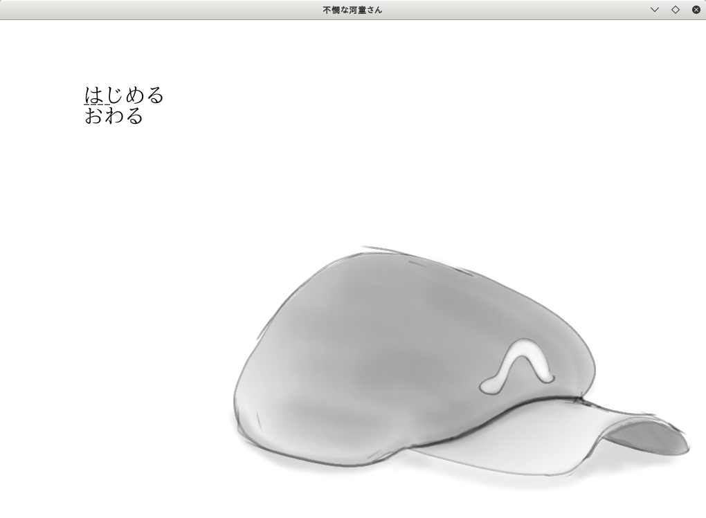

# Novel Game Set ノベルゲーム開発キット

JSONベースで簡単にノベルゲーム開発を行えるソフトウェアです。

## 使い方

これらを定義した上で起動すると動作します。

|JSONファイル名|役割|
|:-|-:|
|setting.json|ゲームの基本情報定義|
|scenes.json|シーンに関する記述がされた各JSONファイルへのパス|
|xxx.json|scenes.jsonにパスが記述されたJSONファイル(通常複数ファイルとなる)|

これらJSONファイルの仕様詳細はWikiなどに書いておこうと思います。

## 動作例

## ライセンス

GPL-3.0